class: middle, center, title-slide

# Advanced Computing Techniques

Lecture 1: Introduction and measuring performance

---

class: middle, center

# Introduction

(Chapter 1)

---

# The Plan

* Intro and Model Performance
* Tree based models
* Neural Networks
* Feature engineering
* Embeddings and pretrained networks
* Interpretability

---

# Timeline

* Six lectures.
    * 15 March, 22 March, 12 April, 19 April, 26 April, 3 May
* Always in this room.
* Six exercises, 1hr after each lecture.
    * We will discuss the questions from the previous week’s lecture.
* One final project.

---

# Marks and Credit

* Show that you learned something new.
* 10% attendance
    * if you can't make it, excuse yourself by email by 8.50am
* 10% per homework
    * does it run?
    * did you make an effort?
* 30% final project

---

# Getting Technical

We will use Python.
* We will use today’s exercise to get you setup with what you need.

We will use GitHub.
* Create an account and repository for the course if you don’t already have one, we can help you during the exercise today.
* Don’t end up with: `final_project_v3_reviewed_final_iteration3.pdf`

---

# The Goal

You will be able to use modern machine-learning methods in your work.

You will
understand the main ideas behind each technique and be ready to dive into the
mathematical details.

---

# Netflix

.width-100[]

---

# Twitter

.width-100[]

---

# Exoplanets

.width-100[]

---

# Higgs Boson

.width-100[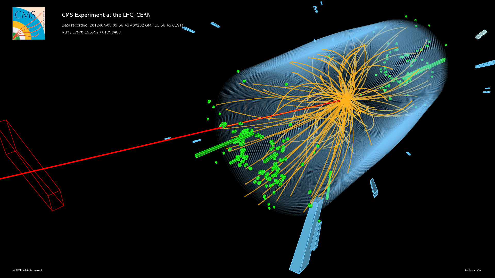]

---

# Tufas

.center.width-90[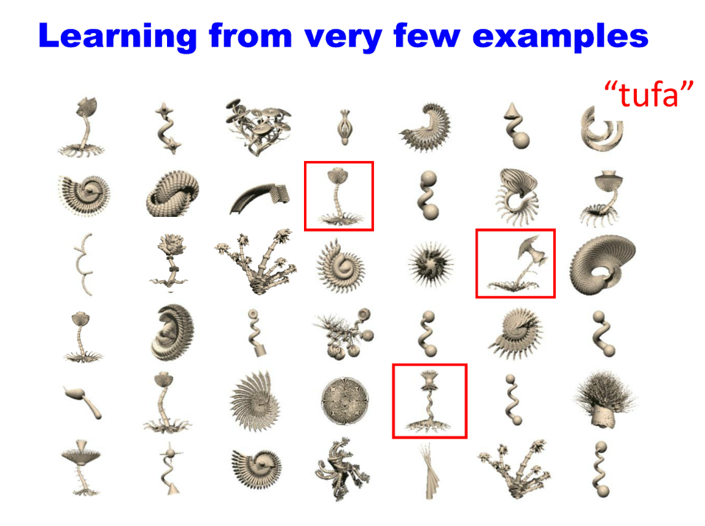]

.footnote[Josh Tenenbaum]

---

class: middle, center
# Machine-learning 
# vs
# Hand crafted rules

---

class: middle, center
# Machine-learning 
# vs
# Statistics

---

# Types of Machine-learning

.larger[
* Supervised
* Unsupervised
* Reinforcement
]

---

# Supervised Learning

.larger[
$$ (x_i, y_i) \propto p(x, y) \text{ i.i.d.}$$
$$ x_i \in \mathbb{R}^p$$
$$ y_i \in \mathbb{R}$$
$$f(x_i) \approx y_i$$
$$f(x) \approx y$$
]

---

# Unsupervised Learning

.larger[
$$ x_i \propto p(x) \text{ i.i.d.}$$
]
Learn about $p$.

---

# Reinforcement Learning

.center.width-90[]

We won't talk about this.

---

# Classification

.center.width-70[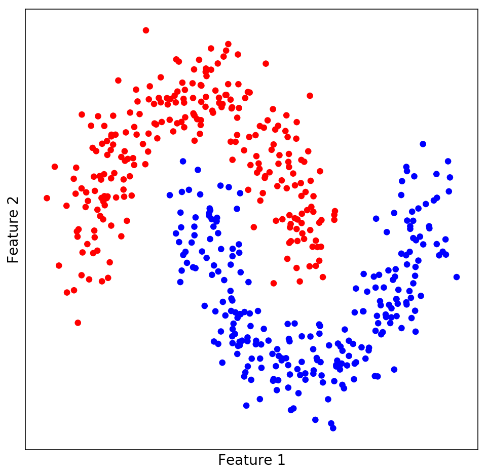]

---

# Regression

.center.width-70[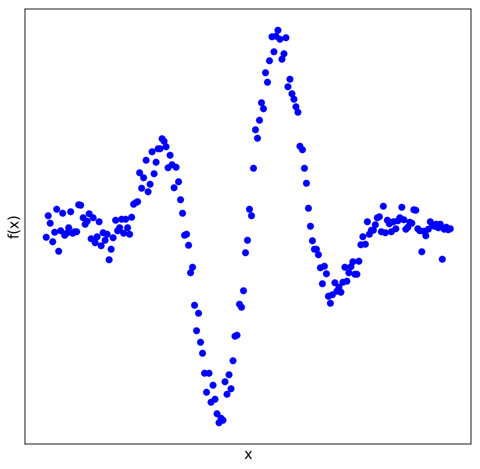]

---

# Notation

I will use $X$ to represent our data. This means $X$ is a matrix of shape $n \times p$ ($n$ samples and $p$ features).

| $i$ | Temperature | Humidity | Percipitation | Comfortable |
| --- | ----------- | -------- | ------------- | ----------- |
| 0   | 12C         | 74%      | 3mm           | yes         |
| 1   | 24C         | 67%      | 0mm           | yes         |
| 2   | 4C          | 91%      | 13mm          | no          |
| $n$ | (...)       | (...)    | (...)         | (...)       |

Each row is a **sample** and each column a **feature**.

---

# Notation

I will use $y$ to represent our labels. This means $y$ is a vector with $n$
entries. One for each sample.

| $i$ | Comfortable? |
| --- | ------------ |
| 0 | yes          |
| 1 | yes          |
| 2 | no           |
| $n$ | (...)        |

For each sample we have one **label**.

---

# Notation

For regression we will use $y$ to represent our **targets**. This means $y$ is a vector with $n$ entries. One for each sample.

| $i$ | Sunshine minutes |
| --- | ------------ |
| 0 | 14          |
| 1 | 28          |
| 2 | 2           |
| $n$ | (...)        |

---

class: middle, center

# Model Performance

(Chapter 2)

---

# $k$ Nearest Neighbours

.center.width-70[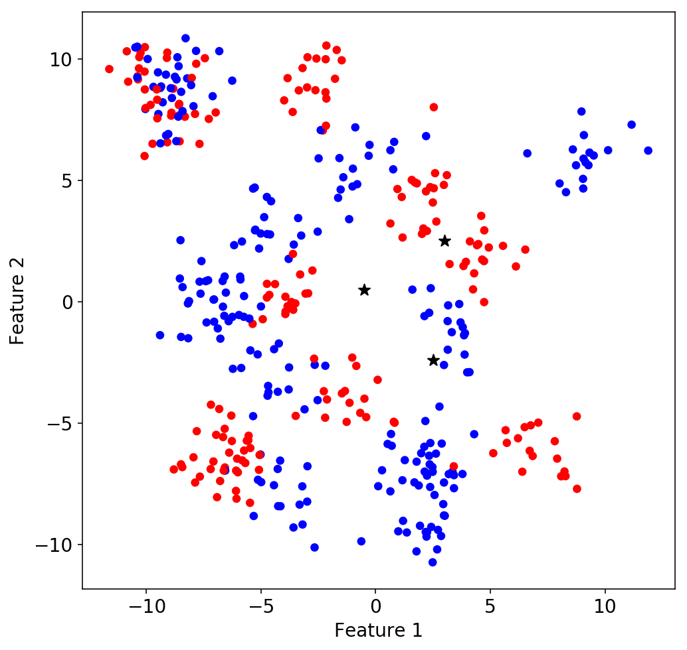]

<div style="margin-top: -20px">
$$f(x) = y_i, i = \mathrm{argmin}_j || x_j - x ||$$
</div>

---

# $k$ Nearest Neighbours ($k=1$)

.center.width-70[]

---

# Accuracy ($k=1$)

What is the accuracy of this classifier?

---

# Generalisation error

We are interested in how well the classifier performs on data from the future.

Split off a fraction of the dataset at the start, use it to simulate the future.

Training data:

| $i$ | Feature 1 | Feature 2 |
| --- | ----------- | -------- |
| 0   | 2.14         | 5.234     |
| 1   | 1.124        | 0.32      |
| 2   | -2.24       | 2.32      |
| 3   | -1.24        | 3.23      |

Testing data:

| $i$ | Feature 1 | Feature 2 |
| --- | ----------- | -------- |
| 4   | 5.34        | 6.34    |
| 5   | 2.24          | -5.23      |

---

# Accuracy ($k=1$)

What is the accuracy of this classifier?

| $k$ | Train | Test |
| --- | ----- | ---- |
| 1 | 1.0 | 0.85 |

---

# $k$ Nearest Neighbours ($k=10$)

.center.width-70[]

---

# $k$ Nearest Neighbours ($k=10$)

.center.width-70[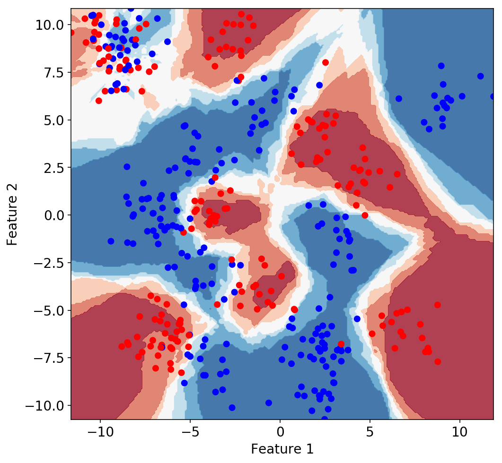]

---

# What happens if you change $k$?

.gallery[

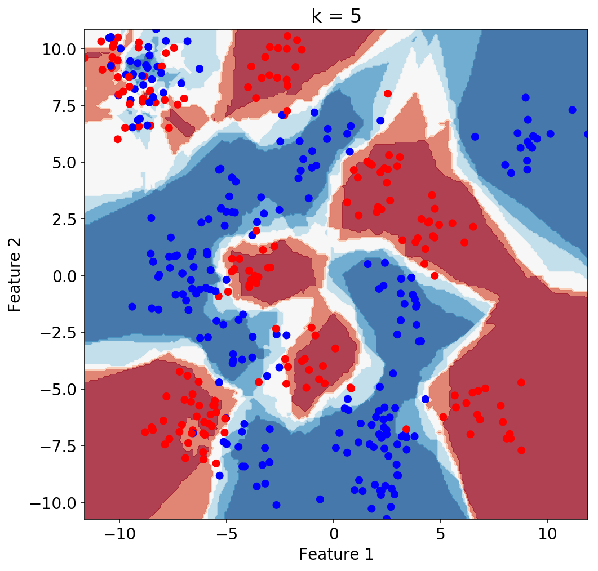

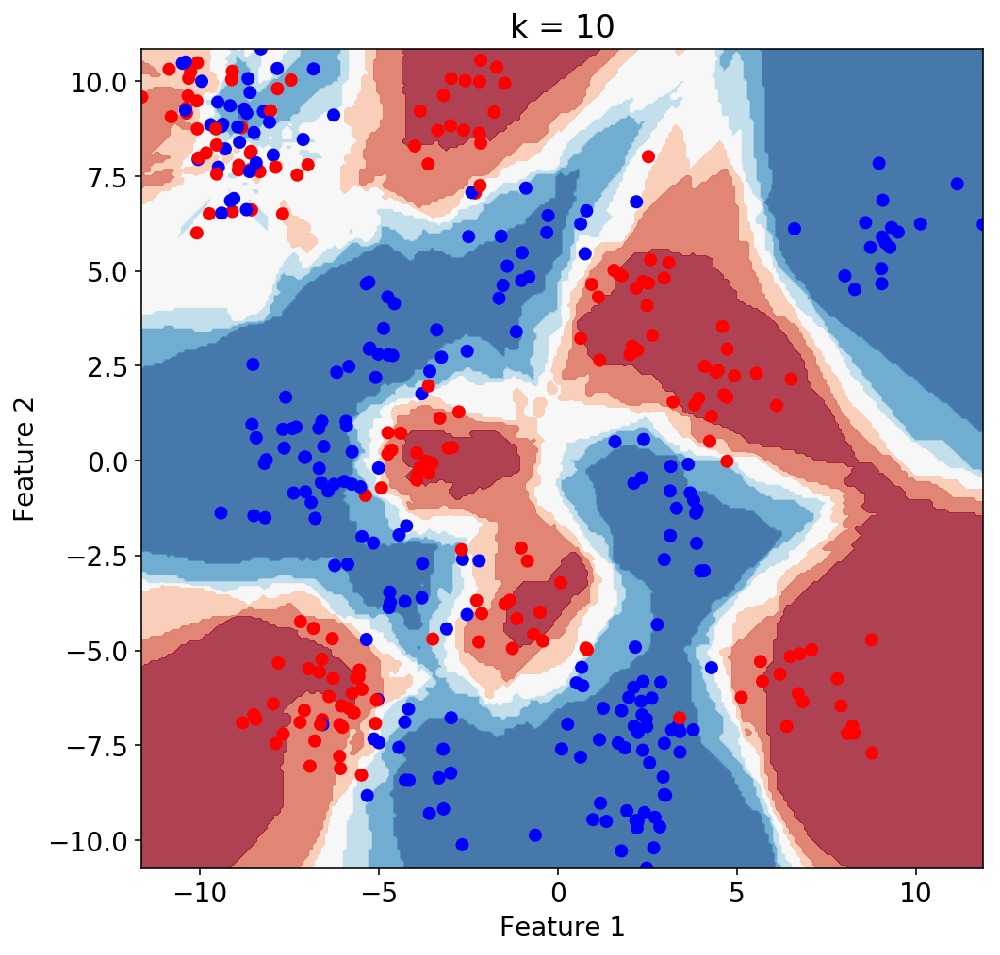
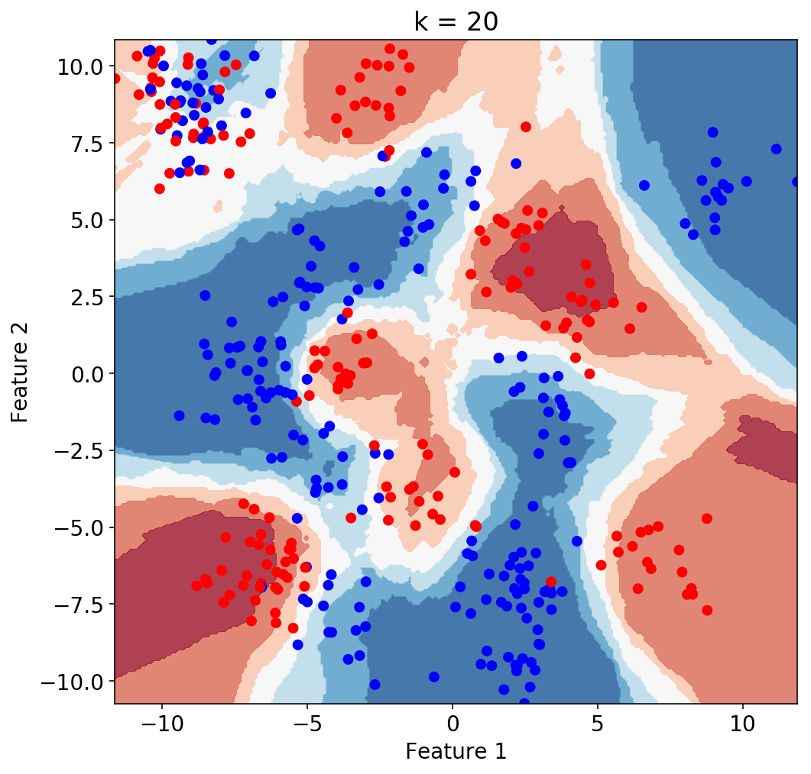
]

---

# What happens if you change $k$?

.center.width-70[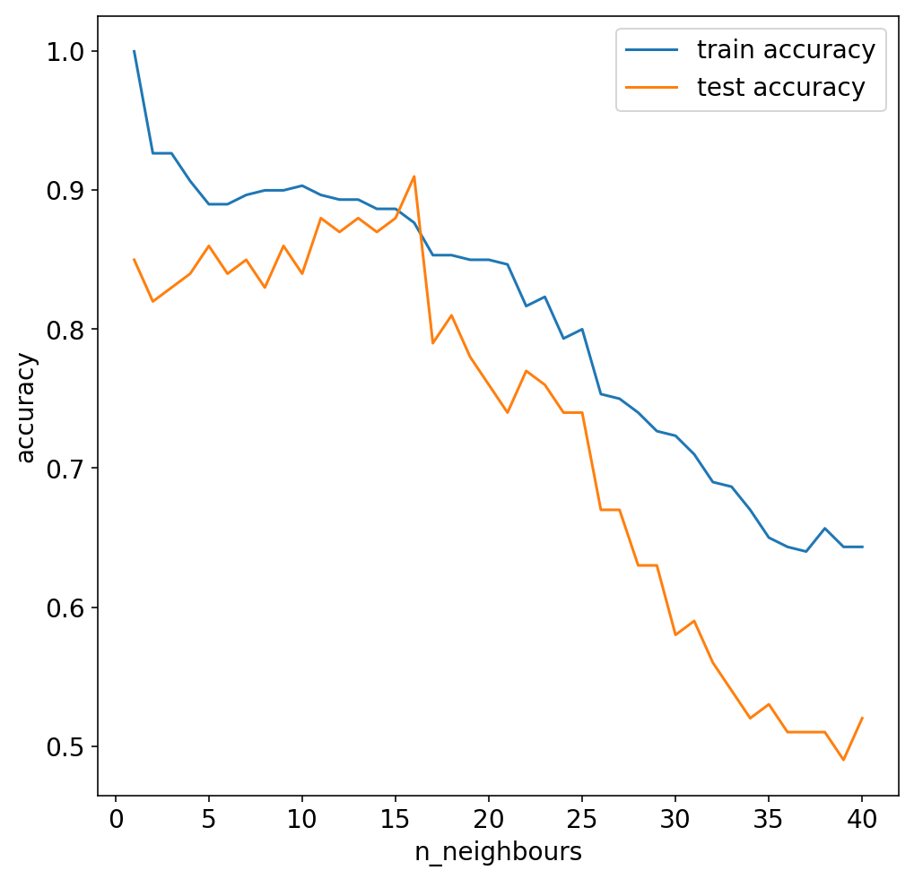]

---

# Under- and Overfitting

.center.width-90[]

---

# Under- and Overfitting

.center.width-90[]

---

# Under- and Overfitting

.center.width-90[]

---

class: middle, center
# Interlude

---

# Three way split

Pro: easy, fast

Con: high variance, "wastes" data

.center.width-100[]

---

# Cross-validation

Pro: stable estimate, better use of data

Con: slower

.center.width-100[]

---

# Cross-validation with a test set

.center.width-90[]

---

class: middle, center
# Interlude

---

# Cross-validation strategies

There are many strategies for splitting your data. Here a few.

You can find several more in the scikit-learn documentation:
http://scikit-learn.org/stable/modules/classes.html#splitter-classes

---

# StratifiedKFold

.center.width-100[]

Makes sure class fractions in the full dataset are correctly
represented in each split.

---

# GroupKFold

.center.width-90[]

All samples from the same group are always in the same split.

* Medical patients
* Satellite images

---

# Accuracy

What fraction of classes did the model predict correctly.

$$ \mathrm{Accuracy} = \frac{\mathrm{TP}+\mathrm{TN}}{\mathrm{TP}+\mathrm{TN}+\mathrm{FP}+\mathrm{FN}} $$

.center.width-90[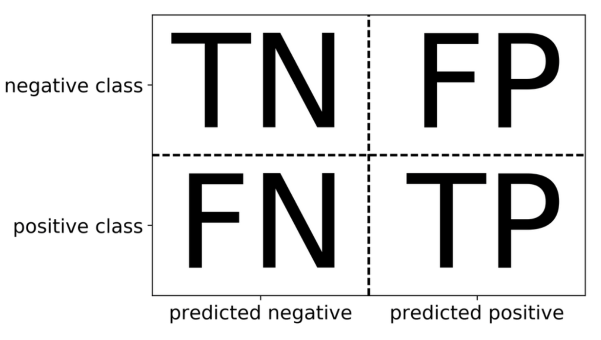]

---

# Precision

How many selected items are relevant?

$$ \mathrm{Precision} = \frac{\mathrm{TP}}{\mathrm{TP}+\mathrm{FP}} $$

.center.width-90[]

---

# Recall

How many relevant items are selected?

$$ \mathrm{Recall} = \frac{\mathrm{TP}}{\mathrm{TP}+\mathrm{FN}} $$

.center.width-90[]

---

# Problems with accuracy

Special offer: Tim's credit card fraud detector. 99.99% accurate!

---

# Problems with accuracy

Special offer: Tim's credit card fraud detector. 99.99% accurate!

If your classes are (very) imbalanced then accuracy is not a good measure.

Tim's favourite baseline: the [`DummyClassifier`](http://scikit-learn.org/stable/modules/generated/sklearn.dummy.DummyClassifier.html).

---

# ROC Area Under Curve (ROC AUC)

Works well for unbalanced classes, shows you what trade offs you can make.

.center.width-80[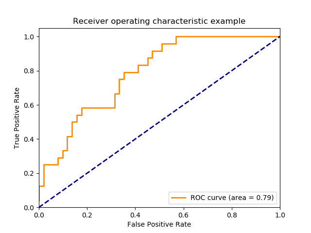]

---

# Changing the threshold

By default scikit-learn classifiers assign classes based on the midpoint of
the possible classifier output (0.5). You can change this threshold to make
different trade-offs.

```
X_train, X_test, y_train, y_test = train_test_split(X, y)

knn = KNeighborsClassifier().fit(X_train, y_train)
y_pred = knn.predict(X_test)
print(classification_report(y_test, y_pred))
```

```
             precision    recall  f1-score   support

      False       0.86      0.86      0.86        51
       True       0.86      0.86      0.86        49

avg / total       0.86      0.86      0.86       100
```
---

# Changing the threshold

By default scikit-learn classifiers assign classes based on the midpoint of
the possible classifier output (0.5). You can change this threshold to make
different trade-offs.

```
X_train, X_test, y_train, y_test = train_test_split(X, y)

knn = KNeighborsClassifier().fit(X_train, y_train)
*y_pred = knn.predict_proba(X_test)[:, 1] > 0.8
print(classification_report(y_test, y_pred))
```

```
             precision    recall  f1-score   support

      False       0.70      0.94      0.80        51
       True       0.90      0.57      0.70        49

avg / total       0.80      0.76      0.75       100
```
---

# Confusion matrix

.center.width-90[]

---

# References

- http://www.cs.columbia.edu/%7Eamueller/comsw4995s18/schedule/
