class: middle, center, title-slide

# Advanced Computing Techniques

Lecture 2: Trees and ensembles

---

class: middle, center

# Decision trees

(Chapter 3)

---

# A decision tree

What should we do today?

.width-100[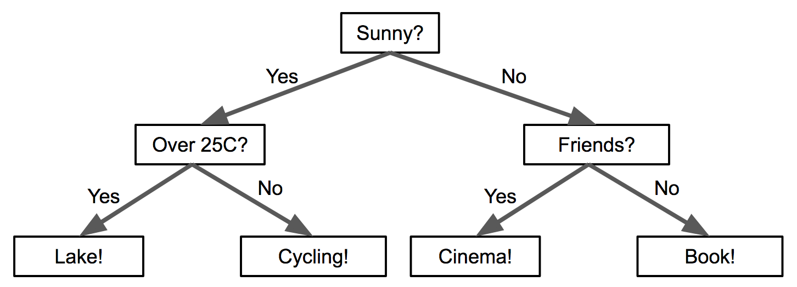]

---

# Dataset

.center.width-80[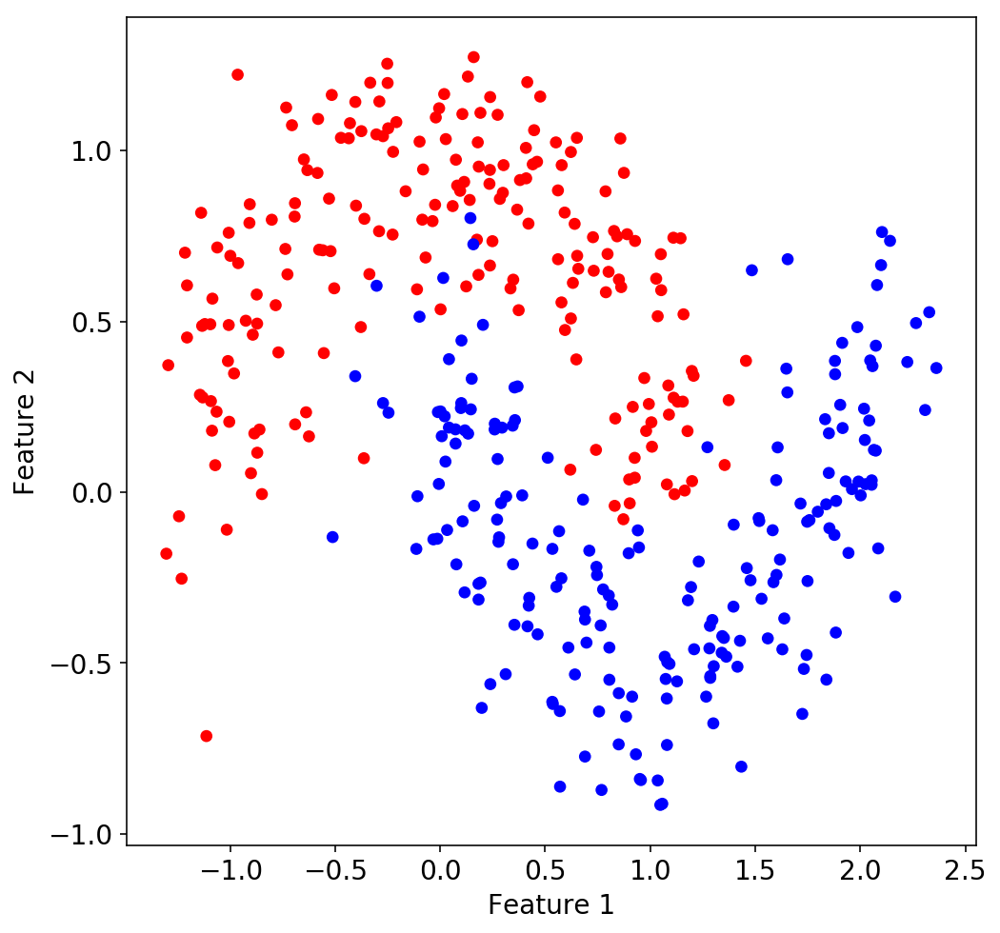]

---

# One level of splits

.center.width-80[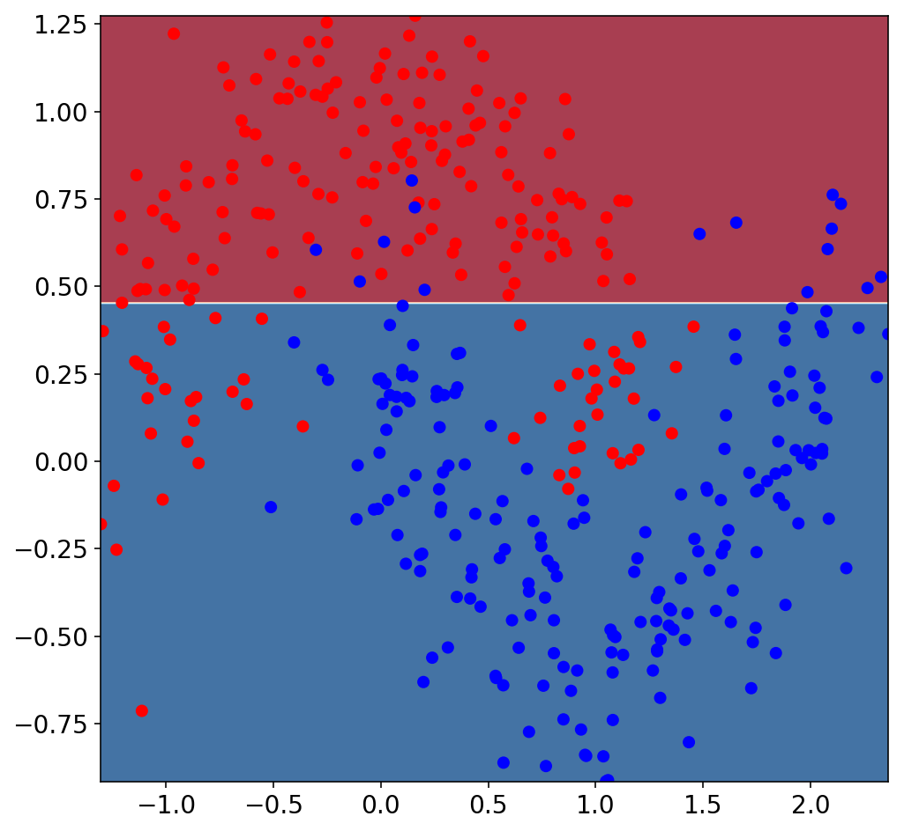]

---

# One level of splits

.center.width-80[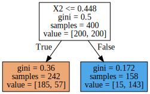]

---

# Two levels of splits

.center.width-80[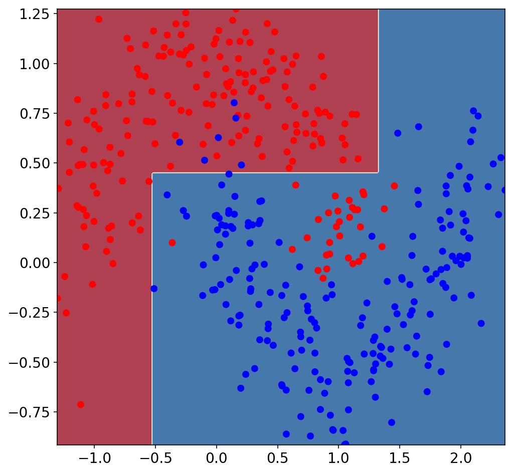]

---

# Two levels of splits

.center.width-80[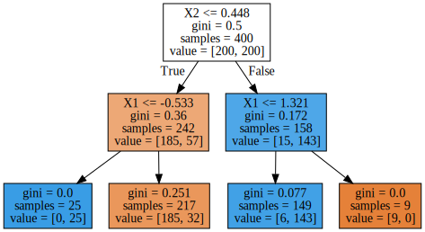]

---

# Three levels of splits

.center.width-80[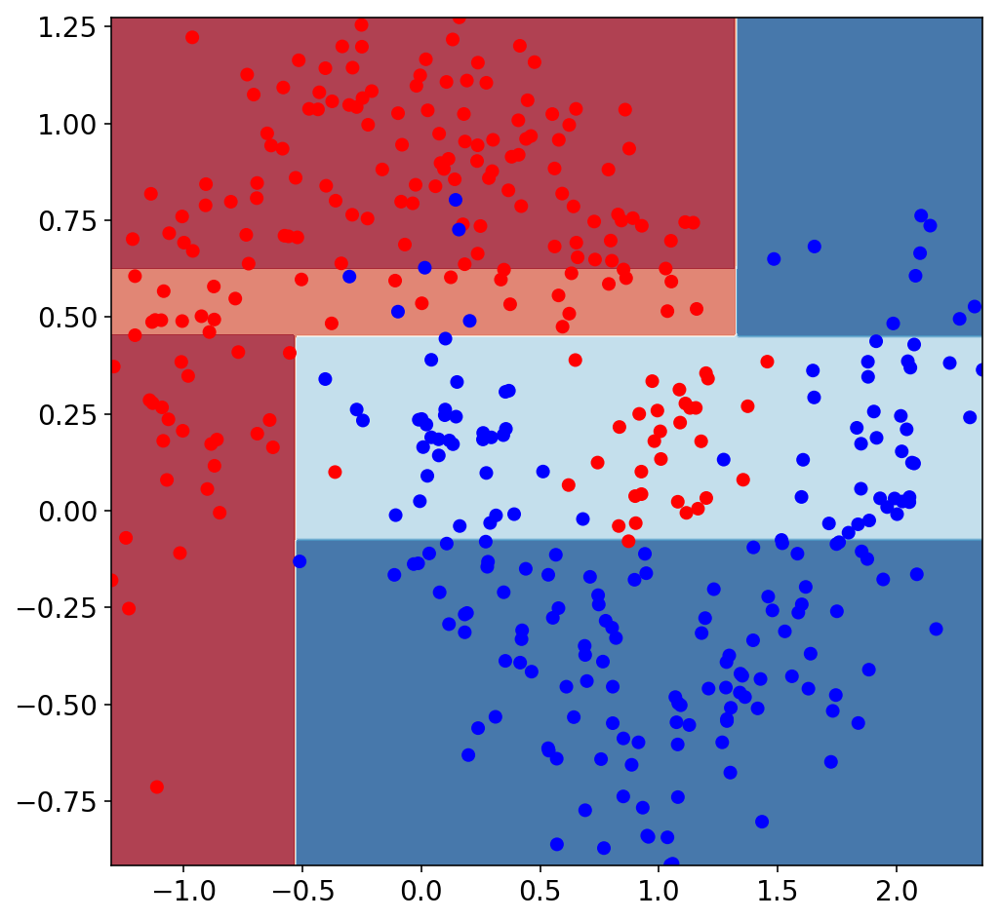]

---

# Three levels of splits

.center.width-80[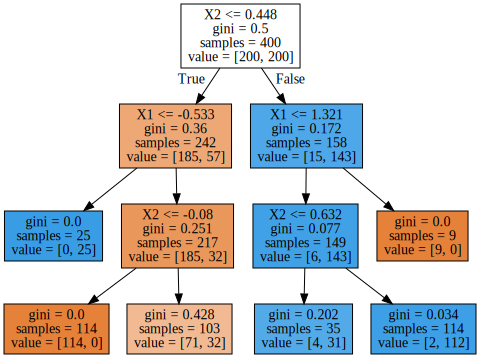]

---

# Ten levels of splits

.center.width-80[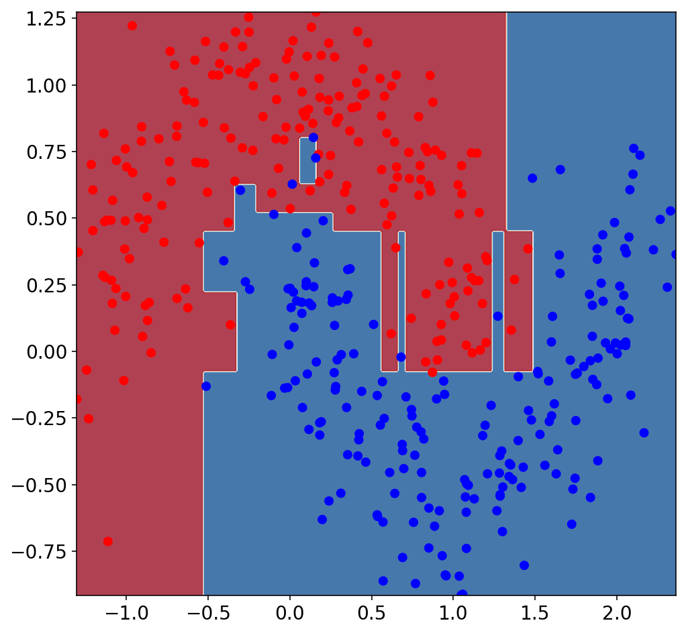]

---

# Ten levels of splits

.center.width-80[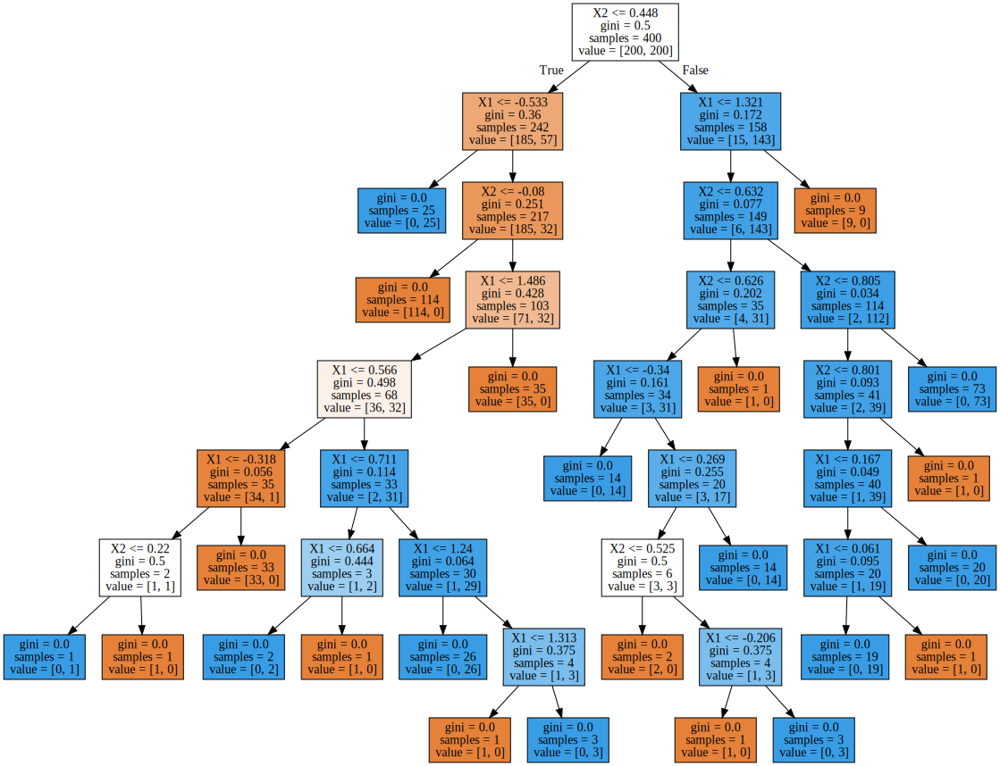]

---

# Making predictions

.center.width-80[]

Put new sample through our tree. When we arrive at a leaf predict that this
sample belongs to the majority class.

$P(R | X) = \frac{R}{B+R}$ and $P(B | X) = \frac{B}{B+R}$

Trees are very fast to execute at prediction/inference time.

---

# How to grow a tree?

The goal is to create leaves that are pure so we can use majority class as
prediction for new samples.

* finding the optimal partioning of the input space is (in general) not feasible
* grow tree in a greedy (one step at a time) fashion!

Algorithm:
1. Pick a node, check if node is pure
    * if yes mark it as a leaf
    * else:
        1. find split point $S$ for feature $j$ that leads to largest decrease of impurity
        1. split node into two child nodes according to this split
2. go to 1.

---

# Two questions, which one is better?

How full is the train? vs What is the weather like?

.center.width-100[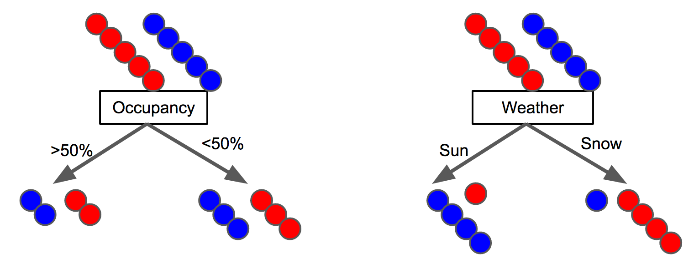]

Trying to predict if a train will be .redbg[delayed] or .bluebg[on time].

---

# Node splitting

For each node find the split point $S$ on feature $j$ that leads to largest
decreases of the impurity.

$$\Delta = I\_T - \frac{n\_L}{N} I\_L - \frac{n\_R}{N} I\_R$$

* $I_T$: impurity of current node
* $I_L$: impurity of left child node
* $I_R$: impurity of right child node

$I_L$ and $I_R$ depend on the feature $j$ and split point $S$ chosen to split
samples in the current node.

---

# Measure impurity of a node

Two common measures for classification tasks:

* cross-entropy: $- \sum\_{k} p\_{mk} \log(p\_{mk})$
* Gini index: $\sum\_k p\_{mk}(1-p\_{mk})$

.center.width-50[]

---

# Tree stops growing when nodes are pure

.center.width-80[]

---

# Tree structure

Growing a fully developed tree generally does not lead to good generalisation.

Either limit tree growth or prune tree after it has been grown.

Implemented in scikit-learn:
* `max_depth`
* `max_leaf_nodes`
* `min_samples_split`
* `min_impurity_decrease`

---

# No limit on tree growth

.center.width-80[]

---

# `max_depth = 3`

.center.width-80[]

---

# `max_leaf_nodes = 8`

.center.width-50[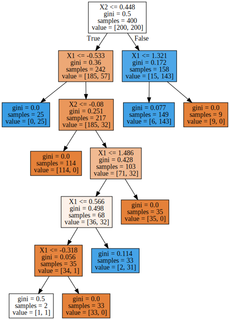]

---

# `min_samples_split = 40`

.center.width-60[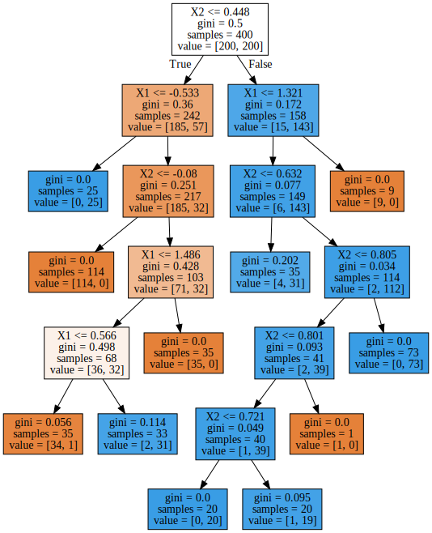]

---

# Regression trees

Prediction:

$$ \bar{y}\_m = \frac{1}{N\_m} \sum_{i \in N\_m} y\_i $$

Impurity measures:
  * mean squared error: $$\frac{1}{N\_m} \sum\_{i \in N\_m} (y\_i - \bar{y}\_m)^2 $$
  * mean absolute error: $$\frac{1}{N\_m} \sum\_{i \in N\_m} |y\_i - \bar{y}\_m|$$

---

# Trees have high variance

Two trees fitted on two random subsets of the same data

 .pull-left.width-100[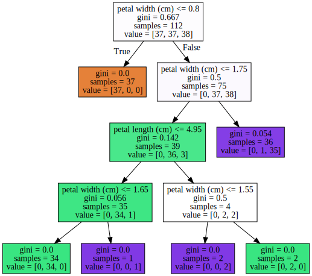]
 .pull-right.width-100[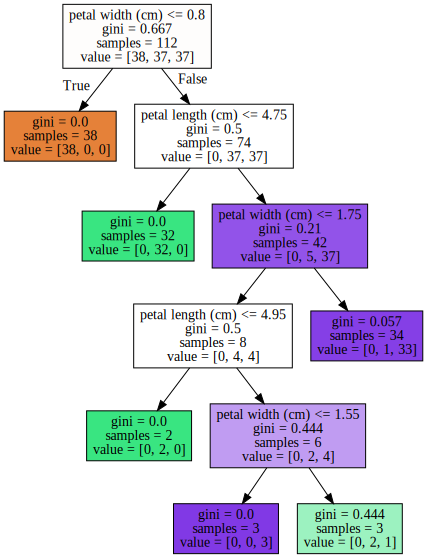]

---

class: middle, center

# Interlude (decision trees, tune max_depth)
show how accuracy plateaus after a while

---

class: middle, center

# Random Forests

(Chapter 4)

---

# Wisdom of crowds

A crowd of non experts can give you a very good estimate if you ask each
individually.

.center.width-80[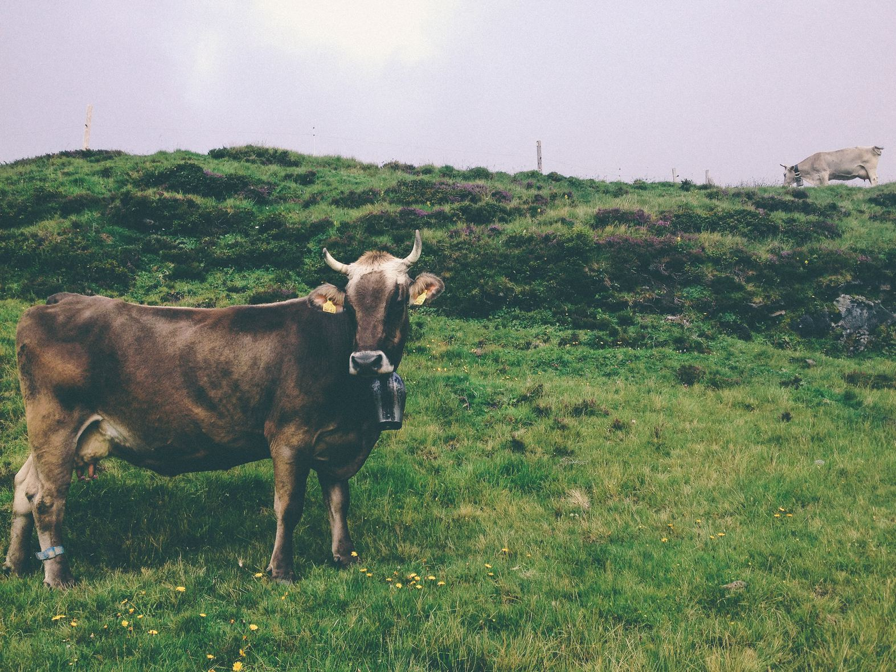]

---

# Wisdom of classifier crowds

Combine several uncorrelated models together:

 .width-100[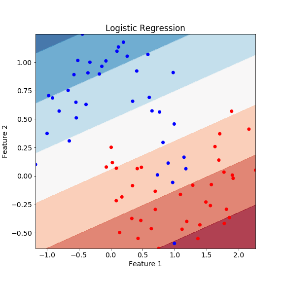]
 .width-100[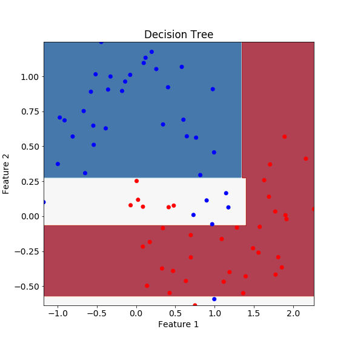]
 .width-100[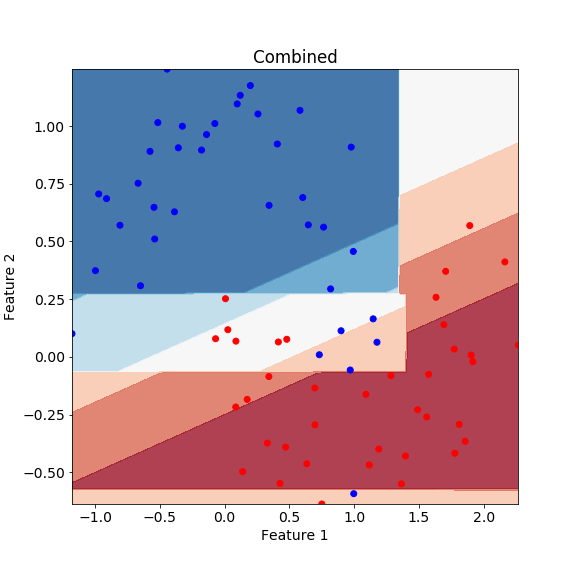]

Combine predictions from logistic regression and a decision tree.

* Accuracy for LogisticRegression: 0.84
* Accuracy for DecisionTree: 0.80
* Accuracy for combination: 0.88

---

# The key: uncorrelated models

How could we build models that are uncorrelated with each other?

---

# The key: uncorrelated models

How could we build models that are uncorrelated with each other?

* only show a subset of the data to each model
* only consider a subset of the features at each split

Bootstrap (sample with replacement):

.center.width-90[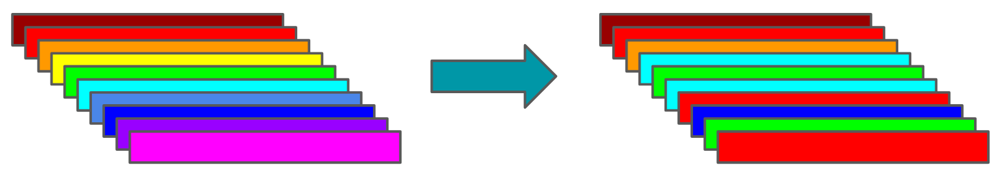]

Select subset of features:

.center.width-90[]

---

# Random forests

Many trees, decorrelate via bootstrap and sampling features at each split.

.center[

 .width-90[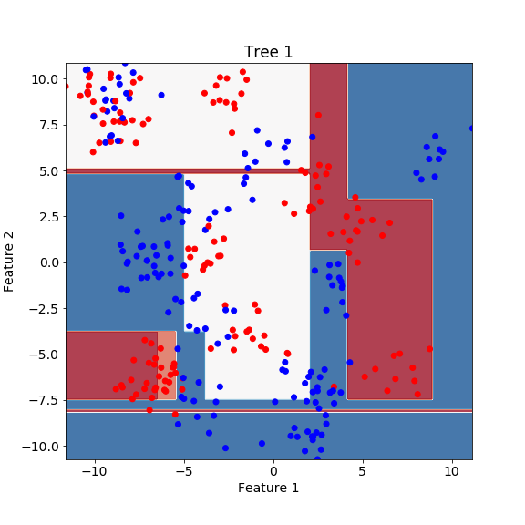]
 .width-90[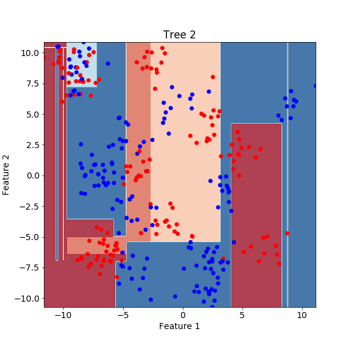]
 .width-90[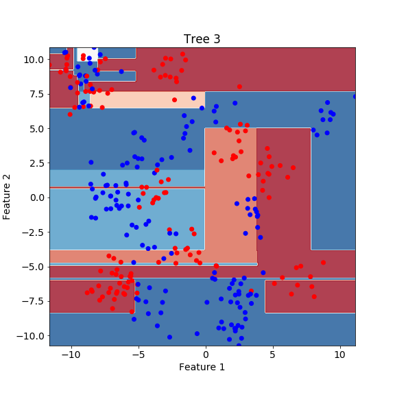]

]

.center[
 .width-30[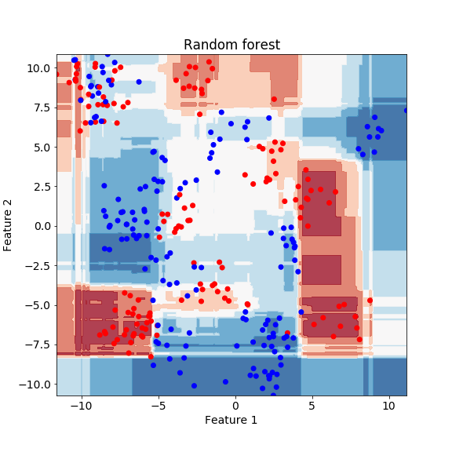]
]
---

# Feature importances

Weighted mean decrease of impurity.

.center.width-60[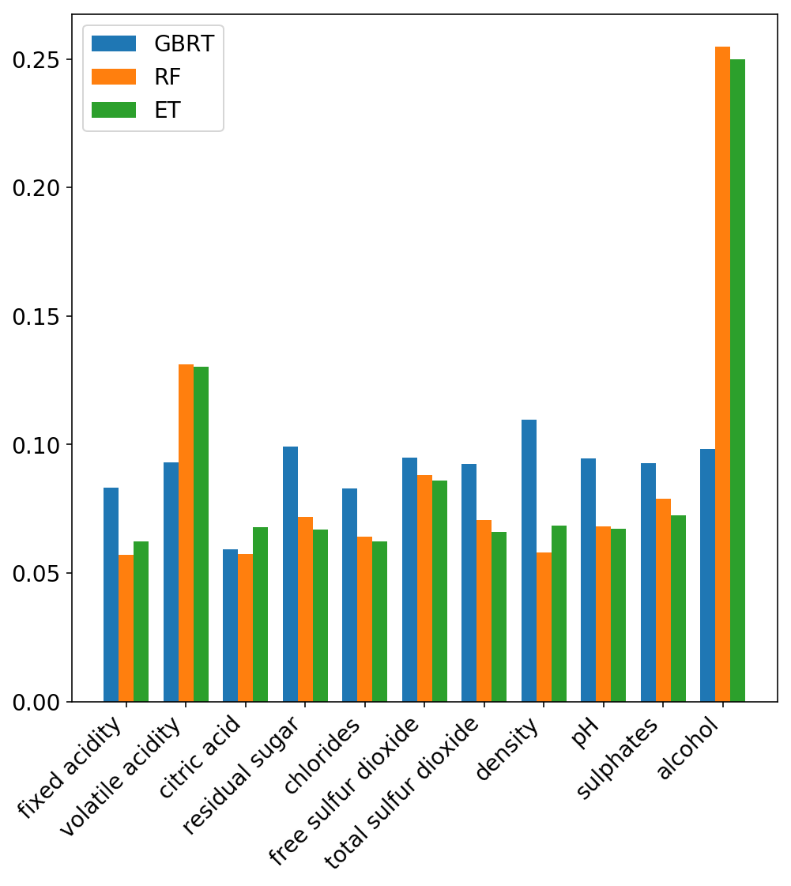]

.footnote[G. Louppe, Understanding Random Forests,
  https://github.com/glouppe/phd-thesis
]

---

class: middle, center

# Gradient boosting

(Chapter 4)

---

# Step by step example

$$f_1(x) \approx y$$

$$f_2(x) \approx y - f_1(x)$$

$$f_3(x) \approx y - f_1(x) - f_2(x)$$

At each step you try and fix the mistakes made by the previous model. The
model is fitted to the residuals of the previous step.

---

# Regression example

.center.width-70[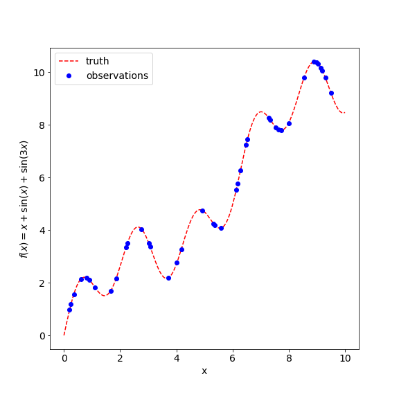]

---

# Stage 0

.center.width-70[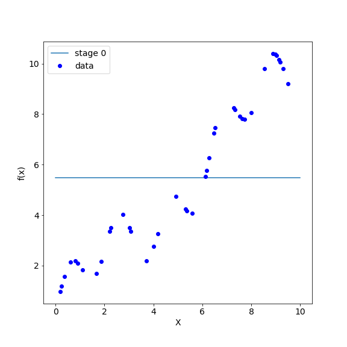]

---

# Stage 0 - residuals

.center.width-70[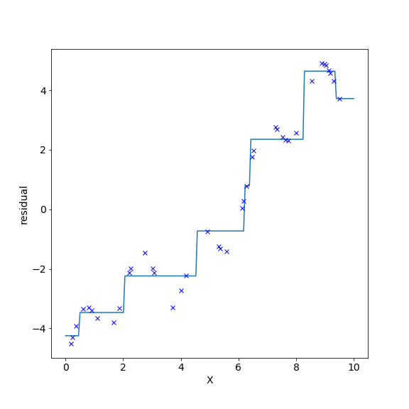]

---

# Stage 1

.center.width-70[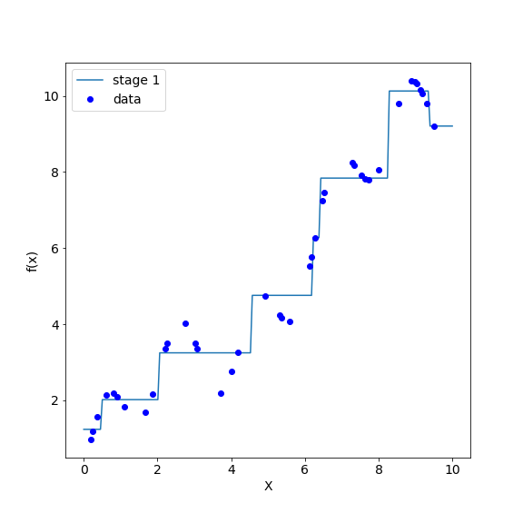]

---

# Stage 1 - residuals

.center.width-70[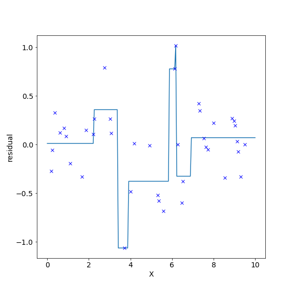]

---

# Stage 2

.center.width-70[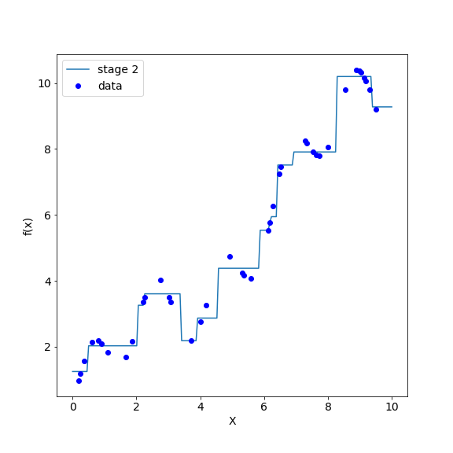]

---

# Stage 2 - residuals

.center.width-70[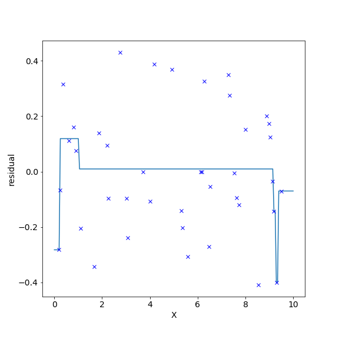]

---

# Stage 3

.center.width-70[]

---

# Full model

.center.width-70[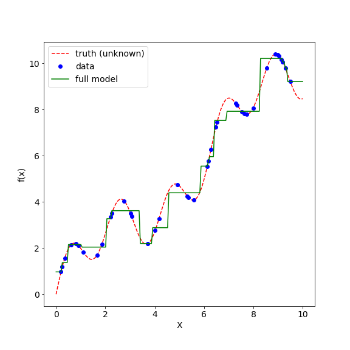]

---

# Step by step example

$$f_1(x) \approx y$$

$$f_2(x) \approx y - \alpha f_1(x)$$

$$f_3(x) \approx y - \alpha f_1(x) - \alpha f_2(x)$$

$$f_4(x) \approx y - \alpha f_1(x) - \alpha f_2(x) - \alpha f_3(x)$$

$$ ... $$

At each step you try and fix the mistakes made by the previous model. The
model is fitted to the residuals of the previous step.

In practice you want to make small adjustments as you go along, each
model is multiplied by $\alpha$. This is also referred to as "shrinkage"
or "learning rate".

---

# Interlude 2

show that you can overfit if you add more and more trees. Unlike RF.

???

Pointer to Catboost and dynamic boost, claims to not overfit.

---

# boosting is a general algorithm

lightGBM

---

# Feature importances

sklearn code to get them, illustrate that it is through eyes of the model
beer brewing comment

---

# Partial dependence plots

Boston housing data or wine?

---

# Tuning gradient boosting

* max_features tends to be small
* smaller learning rate means more trees
* ~1000 trees
* random search example

---

# tuning GBT big/small LR

picture

---

# tuning GBT sub_sample

picture

---

# XGBoost

scikit-learn compatible, faster!

---

# LightGBM

MS, open-source, etc

---

# Viola Jones for face detection

or some other cool example of boosting with simple estimators

---

# Stacking

Combining different kinds of models

---

# Combine models "random forest style"

several models, combine using VotingClassifier(soft)

XXX plot

Can't we learn the weights?

---

# Combine models via LogisticRegression

several models, predict_proba -> fit LogisticRegression

XXX plot

What is the problem now?

---

# cross_val_predict to the rescue

predict_proba on samples that were left out from the fitting, use those
to learn the weights.

---

# Summary

* non linear problems? No problem!
* redundant features? No problem!
* Categorical features? No problem!
* different scales per feature? No problem!

GB is the go to solution for most real world problems. Needs tuning.
