class: middle, center, title-slide

# Advanced Computing Techniques

Lecture 5: Feature engineering

---

# Today

* scaling features
* missing features
* categorical features

---

class: middle, center

# Scaling features

---

# House Price Data

.center.width-60[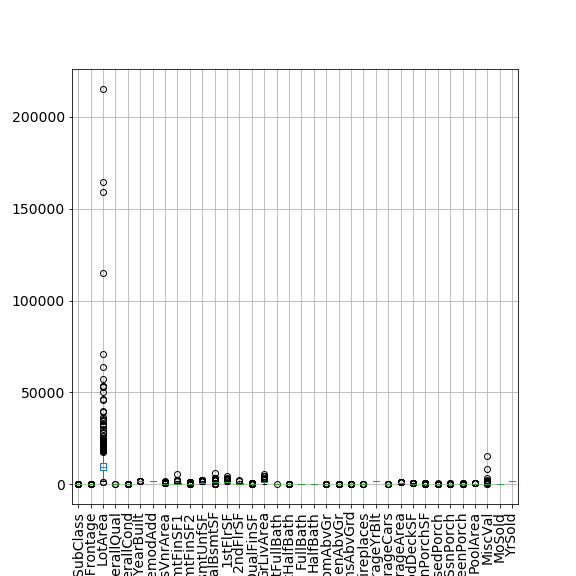]

Models like kNN will ignore the distance in the GrLivArea feature because there is
a huge distance in the LotArea variable.

---

# Just Two Features

For illustration just use two features from the house price dataset.

.width-60[]

---

# Different scalers

Standard scaler: $x = \frac{x - \bar{x}}{\sigma_x}$

.width-60[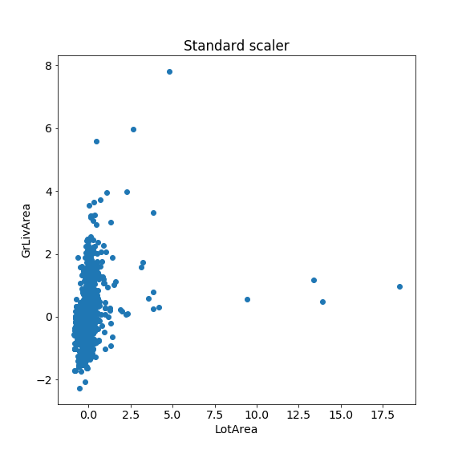]

---

# Different scalers

Robust scaler: use median and quantiles instead of mean and standard deviation.

.width-60[]

---

# Different scalers

MinMax scaler: scale everything to between 0 and 1.

.width-60[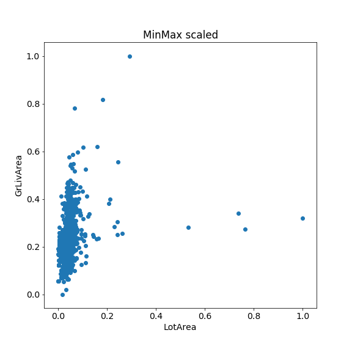]

---

# Scalers in scikit-learn

```
from sklearn.preprocessing import MinMaxScaler
from sklearn.preprocessing import StandardScaler
from sklearn.preprocessing import RobustScaler


scaler = MinMaxScaler()
*scaler.fit(X_train)

*X_train_scaled = scaler.transform(X_train)

lr = LinearRegression().fit(X_train_scaled, y_train)

*X_test_scaled = scaler.transform(X_test)
lr.score(X_test_scaled, y_test)
```

Learns parameters during `fit()` and can the be applied via `transform()`.

---

# Remember:

# Learn scaling parameters from training data only!

.width-100[]

Fit scaler only on the training data!

---

# Cross-validation results

Scaling your features generally improves performance for neural networks,
distance based models, and logistic/linear regression.

```
from sklearn.model_selection import cross_val_score

scores = cross_val_score(KNeighborsRegressor(),
                         X_train, y_train, cv=10)
np.mean(scores), np.std(scores)
# -> (0.4567, 0.0703)
```

```
scores = cross_val_score(KNeighborsRegressor(),
*                        X_train_scaled, y_train, cv=10)
np.mean(scores), np.std(scores)
# -> (0.4081, 0.1688)
```
--
What mistake did we just make?

---

# Information leakage

We fitted the scaler on the whole training data and then performed
cross-validation only for our regression model.

Information Leak
.width-90[]

---

# Information leakage

We fitted the scaler on the whole training data and then performed
cross-validation only for our regression model.

No information Leak
.width-90[]

---

# Pipelines

scikit-learn let's you combine preprocessing steps and estimators into a
pipeline.


```
scaler = StandardScaler()
scaler.fit(X_train)
X_train_scaled = scaler.transform(X_train)

knn = KNeighborsRegressor().fit(X_train_scaled, y_train)
X_test_scaled = scaler.transform(X_test)
knn.score(X_test_scaled, y_test)
# -> 0.564
```

--

Less typing and works with `cross_val_score`:
```
from sklearn.pipeline import make_pipeline


pipe = make_pipeline(StandardScaler(), KNeighborsRegressor())
pipe.fit(X_train, y_train)
pipe.score(X_test, y_test)
# -> 0.564
```

---

# Pipelines in `cross_val_score`

A pipeline behaves just like an estimator.

```
pipe = make_pipeline(StandardScaler(), KNeighborsRegressor())

scores = cross_val_score(pipe,
                         X_train, y_train, cv=10)
np.mean(scores), np.std(scores)
# -> (0.4084, 0.158)
```

---

# Tune the parameters of the whole pipeline

```
from sklearn.model_selection import GridSearchCV


knn_pipe = make_pipeline(StandardScaler(), KNeighborsRegressor())

# parameter names are combo of the name of the step and
# actual name: e.g. KNeighborsRegressor's n_neighbors parameter
param_grid = {'kneighborsregressor__n_neighbors': range(1, 50, 2)}

grid = GridSearchCV(knn_pipe, param_grid, cv=10)
grid.fit(X_train, y_train)

print(grid.best_params_)
print(grid.score(X_test, y_test))
# -> {'kneighborsregressor__n_neighbors': 31}
# -> 0.5665
```

---

class: middle, center

# Dealing with Missing Values

---

# Why are there missing values?

| Room1 m2 | Room2 m2 | Room3 m2 | Price |
|----------|----------|----------|-------|
| 20 | 14 | - | 800 |
| 18 | 15 | 12 | 950 |
| 23 | 18 | 11 | 823 |

Let's imagine we are collecting data about houses and their prices.
* We can't determine the size of the third room in a two bedroom house
* The surveyor forgot to write down the size of the third bedroom

Almost always there is a reason for the missingness!

--

If represented by `NaN` (not a number) many libraries like `scikit-learn` will
refuse to work until you did something to the data.

However, often missing values are represented by "magic values" like
-1, -999, 0, +999, etc.

---

# How much is missing?

```
import missingno as msno

msno.matrix(X)
```

.width-100[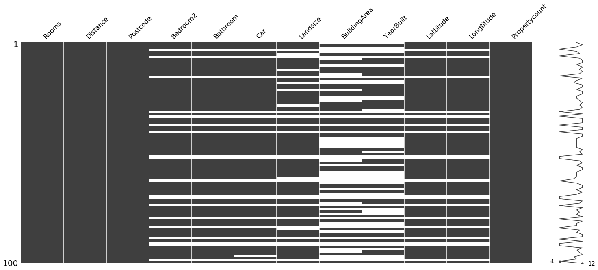]

---

# How much is missing?

```
import missingno as msno

msno.bar(X)
```

.width-100[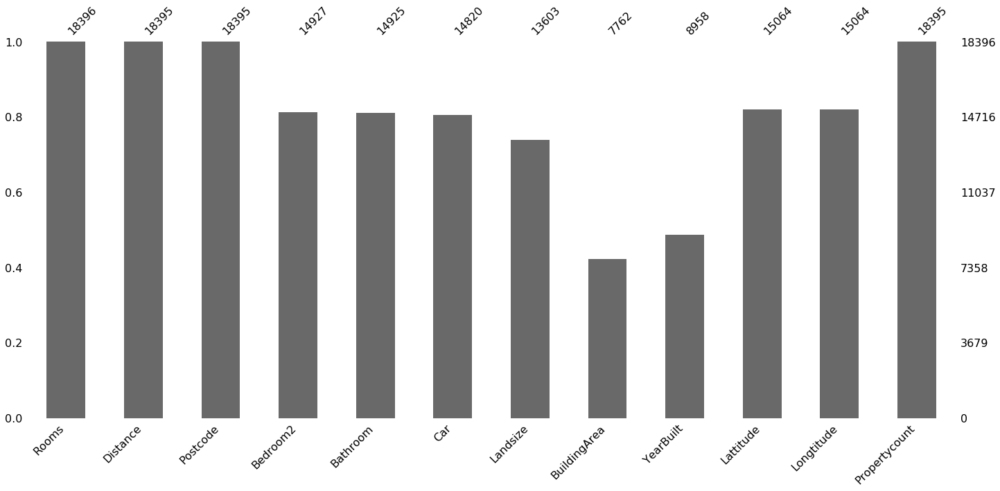]

---

# Just drop them

Simplest possible thing to do is drop columns that contain missing values.

.width-100[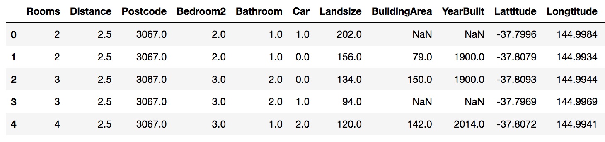]

In code:
```
with_missing = np.any(np.isnan(X_train), axis=0)

X_train_drop = X_train[:, ~with_missing]
X_test_drop = X_test[:, ~with_missing]
```

---

# Impute them

Fill missing values with a typical value based on the sampels where feature
is present.

There are different strategies for how to impute the missing values.
* If "mean", then replace missing values using the mean along the axis.
* If "median", then replace missing values using the median along the axis.
* If "most_frequent", then replace missing using the most frequent value along the axis.

```
from sklearn.preprocessing import Imputer

imputed = make_pipeline(Imputer(), RandomForestRegressor())
imputed =  make_pipeline(Imputer('median'),
                         RandomForestRegressor())
```

---

# Predict them based on a model!

Fill the missing value based on a sample's ($x^*$) neighbours.

kNN based approach:
* compute distance of $x^\*$ to each other sample using only features that are
  not missing in $x^*$
* pick $k$ nearest and impute missing values in $x^*$ by averaging the values
  in the $k$ neighbours.

---

# Predict them based on a model!

Fill the missing value based on a regression model for each column.

Make a first guess of the missing values using mean imputation.

Then, for each column $i$ with missing data:
* fit a regression model to all other columns using the rows where $i$ is not
  missing
* for rows where feature $i$ is missing predict the value using the regression
  model

Iterate this procedure several times until changes stabilise.

---

# Demo: imputers

---

class: middle, center

# Dealing with Categorical Values

---

# One-hot Encoding

Each item in our dataset is either a apple, banana, or orange.

There is no order to these categories. Add a new feature for each
category and set the feature to 1 if the row belongs to that category.

| apple | orange | banana |
|-------|--------|--------|
| 1 | 0 | 0 |
| 1 | 0 | 1 |
| 0 | 1 | 0 |

---
# Example

```
data = pd.DataFrame({'pet':      ['cat', 'dog', 'dog', 'fish',
                                  'cat', 'dog', 'cat', 'fish'],
                     'rating':   ['good', 'good', 'best', 'great',
                                  'great', 'good', 'great', 'good'],
                     'children': [4., 6, 3, 3, 2, 3, 5, 4],
                     'salary':   [90, 24, 44, 27, 32, 59, 36,
                                  27]})
```

---

# One-hot encoding

```
import category_encoders as ce

encoder = ce.OneHotEncoder()
encoder.fit_transform(data)
```

.center.width-90[]

---

# Ordinal encoding

```
import category_encoders as ce

encoder = ce.OrdinalEncoder(mapping=[{'col': 'rating',
                                      'mapping': [('good', 0),
                                                  ('great', 1),
                                                  ('best', 2)]}])
encoder.fit_transform(data)
```

.center.width-50[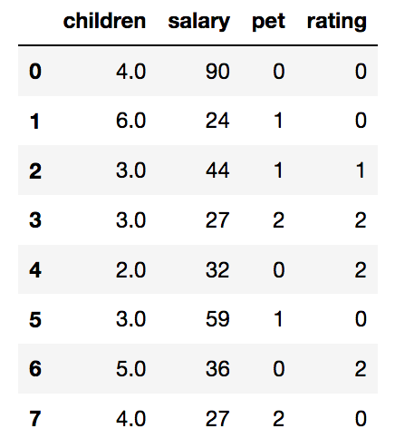]

---

# Trouble with one-hot encoding

The Melbourne house price dataset contains several categorical variables.

.center.width-90[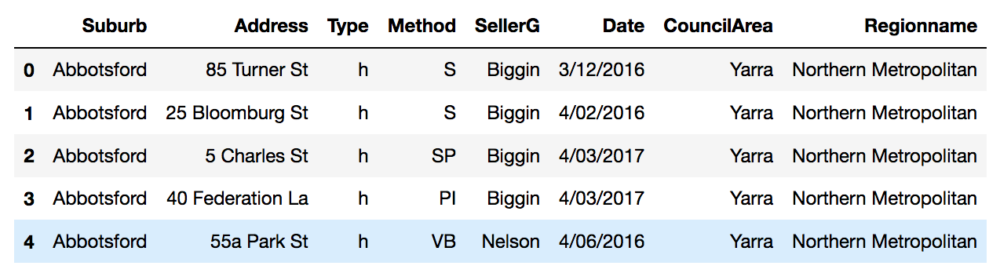]

--

.center.width-90[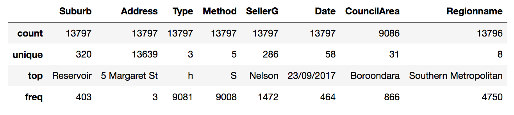]

Some of which have a lot of different values!

---

# Trouble with one-hot encoding

The Melbourne house price dataset contains several categorical variables, if
you one hot encode it you end up with this:

.center.width-90[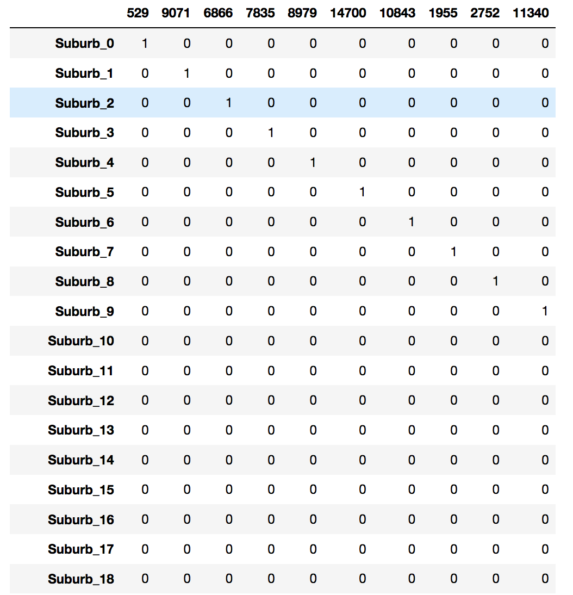]

---

# Hashing

For each categorical feature compute the hash of the value and increase count
by one at:  $i = h(\mathrm{value}) \mathrm{mod} N$

.center.width-90[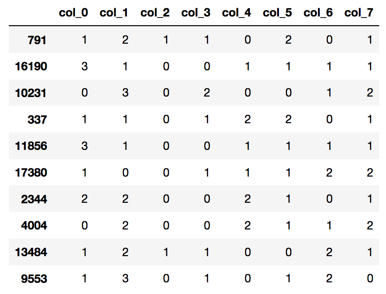]

---

# Hash functions

A hash function is any function that can be used to map data of arbitrary
size to data of fixed size. The values returned by a hash function are called
hash values. (from Wikipedia)

```
hash("hello")
# -> 7099435880507081110
hash("world")
# -> 4303340285849353031
hash("hEllo")
# -> 3393269324545715284
```

---

# Count-based encoding

* For high cardinality categorical features
    * For example suburbs in the Melbourne house price data
* Use the response/target to create one new feature
* Binary classification: "houses in this suburb have likelihood $p$ for class 1"
* Regression: "houses in this suburb have an average response of $y$"

---

# Encoding the suburb

```
price_by_suburb = data.groupby("Suburb").Price
average_price = price_by_suburb.mean() / price_by_suburb.mean().max()
```

.center.width-50[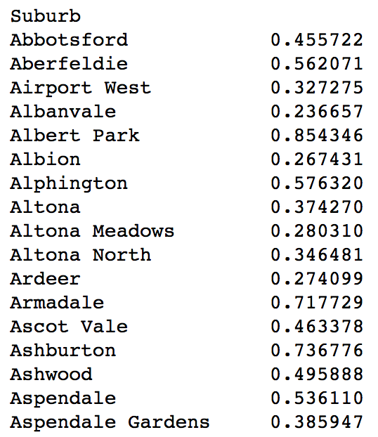]

---

# Encoding the suburb
```
data['Suburb_freq'] = data['Suburb'].map(average_price)
data[['Suburb_freq', 'Suburb']].sample(10)
```

.center.width-50[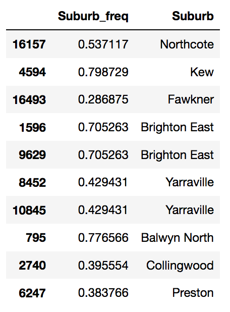]

---

# CatBoost

CatBoost is an implementation of gradient boosted trees with special support
for categorical features.
* open-source project started by Yandex
* knows about many different encoding schemes and picks them automatically
  based on statistics of a feature

```
from catboost import CatBoostClassifier

cb = catboost.CatBoostRegressor()
# have to specify index of our categorical features
cb.fit(X_train, y_train, cat_features=list(range(8)))
```

---

# Demo: categorical features

---

# Slightly more sanity to feature transforms

sklearn-pandas
* https://github.com/scikit-learn-contrib/sklearn-pandas
* A way to map `DataFrame` columns to transformations
* and then combine columns into features

---

# Slightly more sanity to feature transforms

```
data = pd.DataFrame({'pet':      ['cat', 'dog', 'dog', 'fish',
                                  'cat', 'dog', 'cat', 'fish'],
                     'rating':   ['good', 'good', 'best', 'great',
                                  'great', 'good', 'great', 'good'],
                     'children': [4., 6, 3, 3, 2, 3, 5, 4],
                     'salary':   [90, 24, 44, 27, 32, 59, 36,
                                  27]})

mapper = DataFrameMapper([
 ('pet', sklearn.preprocessing.LabelBinarizer()),
 (['children'], sklearn.preprocessing.StandardScaler())
])
```

---
# Slightly more sanity to feature transforms

```
>>> np.round(mapper.fit_transform(data.copy()), 2)
array([[ 1.  ,  0.  ,  0.  ,  0.21],
       [ 0.  ,  1.  ,  0.  ,  1.88],
       [ 0.  ,  1.  ,  0.  , -0.63],
       [ 0.  ,  0.  ,  1.  , -0.63],
       [ 1.  ,  0.  ,  0.  , -1.46],
       [ 0.  ,  1.  ,  0.  , -0.63],
       [ 1.  ,  0.  ,  0.  ,  1.04],
       [ 0.  ,  0.  ,  1.  ,  0.21]])
```

---

Fin
