class: middle, center, title-slide

# Advanced Computing Techniques

Lecture 6: Interpretability

---

# Who needs interpretability anyway?

Do you care why your self-driving car doesn't kill you?

--

Can you explain what you do when you avoid a door that suddenly opened when
cycling past a row of parked cars?

--

I don't really care why it works, I care that it is predictable. This means I
trust the system.

--

Maybe we need interpretations when it is hard to define "it works" or the simple
metric we use to optimise our algorithm doesn't encapsulate everything.

---

# What is interpretability anyway?

What does it mean for a model to be interpretable?

--
* we are able to follow the computation with pen&paper?
* we are able to ascribe meaning to each parameter of the model?
* we are able to look at the whole model at once?
* we are able to predict what the model will do for a particular case?

---

# Simulatability

Given the features and weights a human can step through every calculation
required to make a prediction in a reasonable amount of time.

Sparse linear model is more interpretable than a dense linear model.

--

The size of a decision tree can grow much faster than the number of steps
needed to make a prediction.

Use computation time not number of weights as metric?

---

# Decomposability

Each component of a model can be explained. For example a node in a tree:

```All patients with blood pressure > 130```

is nice and understandable.

However this requires that input features themselves are interpretable. What
does a decision rule like `all images with pixel number 130 > 4` mean?

---

# Algorithms

Do we understand the algorithm? Can we make gurantees about it?

For a linear model the loss is convex, it can be prooven that we will always
find the global minimum. No such promises for modern deep learning.

However, humans aren't convex optimisation problems either ...

---

class: middle, center

# Interpretability for scientists

---

# Discriminative models

Decisions trees and neural networks are discriminative models.

They directly model $p(y | x)$.

As the name suggests they are all about discriminating between classes.

Directly solves the task at hand, does not first solve an intermediate problem.

---

# Downsides of discriminative models

Directly solves the task at hand, does not first solve an intermediate problem.

* hard to extract information about the process that lead to the outcome
* hard to add human expertise or enforce constraints
* parameters don't (usually) have any meaning
* (does a NN learn "the invariant mass" of a particle when searching for the Higgs?)

---

# Generative models

A generative model learns the joint distribution $p(x, y)$.

Then use Bayes rule to compute $p(y|x)$.

As an end result we get a model that can generate new examples. A "waste product"
is that we can classify examples.

---

# For example: Naive Bayes

An example of a generative model used to perform classification.

Assume that every pair of features is independent:

$$P(x_2 | y, x_1) = P(x_2 | y)\,\, \mathsf{and}\,\, P(x_1 | y, x_2) = P(x_1 | y)$$

The big advantage is that we can model each $P(x_i|y)$ using a 1D pdf.

Use Bayes rule:
$$P(y | x_1, x_2) = \frac{P(y) P(x_1 | y) P(x_2 | y)}{P(x_1, x_2)}$$

Despite the assumption of independence Naive Bayes models work quite well.

---

# Generative models or probabilistic programming

We can write a "program" that encodes our human expertise and uses parameters
that we can ascribe meaning to and use this as the generative model.

---

# Will a student get a good letter from their professor?

We know the difficulty of the course, student's grade and the SAT score of
the student.

If we collect enough data we can build a model that predicts the goodness of
the letter based on the input variables.

--

How does difficulty and grade work together? What about intelligence?

--

.width-80.center[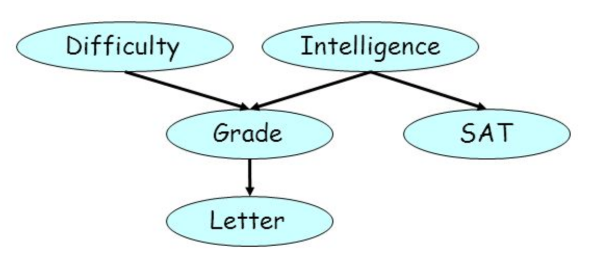]

---

# The point of this is ...

... often people use machine-learning techniques when really they
want to learn parameters of the model. Don't do that.

Probabilistic Graphical Models, or Bayesian networks seem like a much more
natural fit.

Probabilistic programming and friends is a huge topic, worth several lecture
courses. Maybe this got you interested.

* https://blog.statsbot.co/probabilistic-graphical-models-tutorial-and-solutions-e4f1d72af189
* https://ermongroup.github.io/cs228-notes/
* http://camdavidsonpilon.github.io/Probabilistic-Programming-and-Bayesian-Methods-for-Hackers/
* and many more

---

class: middle, center

# Debugging your machine-learning models

---

# Still interested in interpretability?

Most tools for interpretability are aimed at people literate in statistics and
maths. These are tools for you to debug your models and make sure they
"just work" for your "customers".

--

Treat your machine-learning model like a research problem. Generate hypotheses
that you can falsify and then check them.

---

# Permute a feature

Permute a column and recompute your performance metric. The amount your metric
get's worse by is the score of that feature. More important features lead to
a bigger decrease.

This is the original "feature importance" metric proposed by Breiman for
Random Forests. You don't need a RF to use it though.

---

# Partial Dependence Plots

.center.width-60[]

$$ \hat{f}(x\_s) = \frac{1}{N} \sum \hat{f} (x\_s, x_{Ci})$$

Disadvantage: if half your samples have a positive dependence on feature S, and
the other half a negative dependence your PDP plot will be flat.

.footnote[From https://christophm.github.io/interpretable-ml-book/pdp.html]

---

# Flat lining

.center.width-90[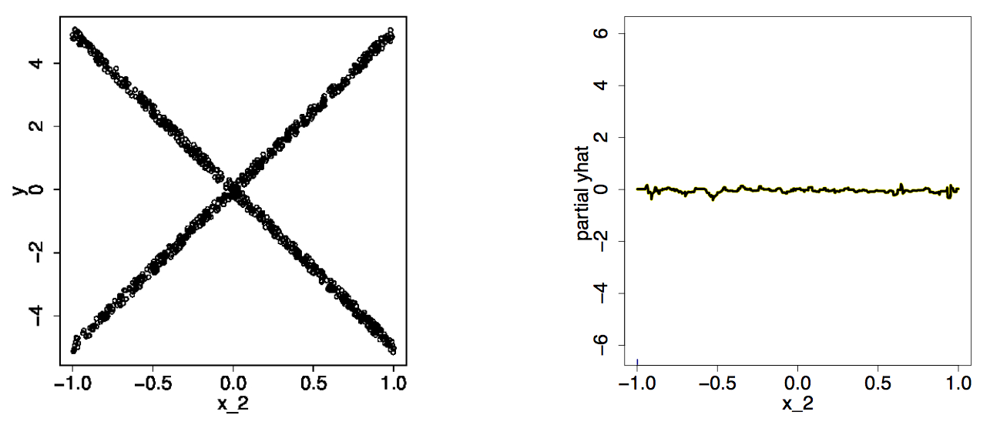]

Disadvantage: if half your samples have a positive dependence on feature S, and
the other half a negative dependence your PDP plot will be flat.

.footnote[https://arxiv.org/abs/1309.6392]

---

# Individual Conditional Expectation

.center.width-60[]

Like PDP plot but without averaging. Each line is one sample.

$$ \hat{f}\_i (x\_s) = \hat{f} (x\_s, x_{Ci})$$


.footnote[https://arxiv.org/abs/1309.6392, https://christophm.github.io/interpretable-ml-book/ice.html]

---

# Locally, earth is flat!

To help explain decisions from non-linear models like trees or neural networks
we can assume that locally a linear model would suffice to make the same
prediction.

A bit like neglecting that the earth is a ellipsoid when measuring the size
of this room.

The assumption is that two samples close to each other will be classified
the same.

--

#### Fit a linear model to the vicinity of a sample, and then interpret the linear model.

This idea is known under the name LIME: https://arxiv.org/abs/1602.04938

---

# The LIME procedure

1. For each sample to explain, permute the observation $n$ times
1. Use the complex model to predict the outcome of all permuted observations
1. Calculate the distance from all permutations to the original observation.
1. Convert the distance to a similarity score.
1. Select $m$ features that best describe the complex model outcome from the permuted data
1. Fit a simple model to the permuted data, explaining the complex model outcome with the $m$ features from the permuted data weighted by its similarity to the original observation
1. Extract the feature weights from the simple model and use these as explanations for the complex models local behavior

---

# The LIME procedure

.width-80.center[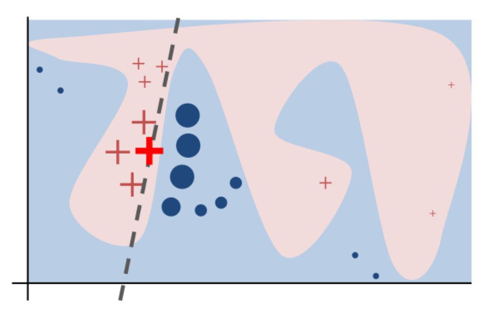]

---

# Permuting samples

For tabular data compute the mean and standard deviation of each feature,
then sample from a normal distribution with those parameters.

--

For images use superpixels as the feature, even if your model looks at pixels
directly

.center.width-50[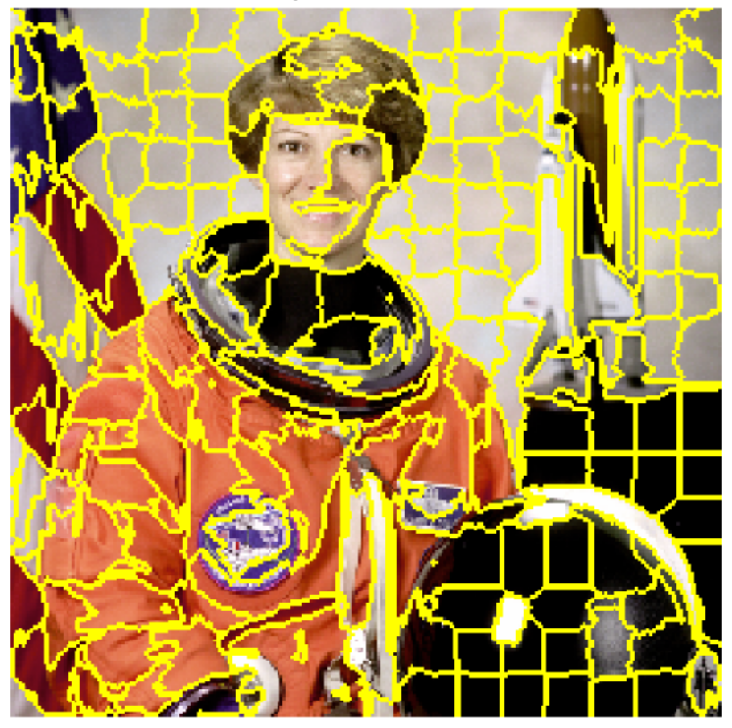]

---

# Sampling

.center.width-70[]

.footnote[From https://christophm.github.io/interpretable-ml-book/lime.html]

---

# Feature selection

As a user you need to decide how many features $m$ you want to have in your
explanation. More features lead to better local models and more complex
explanations. Between five and ten seems to work well in practice.

---

# Feature selection

Fit a interpretable model with $m$ features.

Potential models:
* sparse linear model
* shallow decision tree

How to select the $m$ features depends on the model you use.

---

# Fitting

For each of the $n$ perturbed samples ask the complex model to make a prediction,
then fit the simple model to this dataset.

---

# Examples

How many bikes will be used from the bike share today?

.center.width-70[]

.footnote[From https://christophm.github.io/interpretable-ml-book/lime.html]

---

# Relationship advice from a model?

.center.width-70[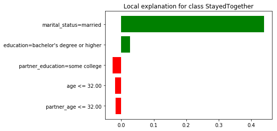]

Probability of staying together ~0.89. The model attributes this to the couple
being married. The fact that they are young reduces their chances.

.footnote[From http://blog.fastforwardlabs.com/2017/09/01/LIME-for-couples.html]

---

# Relationship advice from a model?

.center.width-80[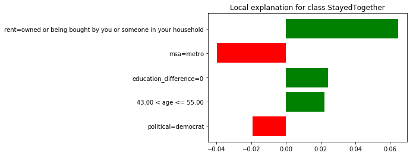]

P(together) ~ 0.75. Apparently voting democrat and living in an urban area are
working against this couples chances.

.footnote[From http://blog.fastforwardlabs.com/2017/09/01/LIME-for-couples.html]

---

# Relationship advice from a model?

.center.width-90[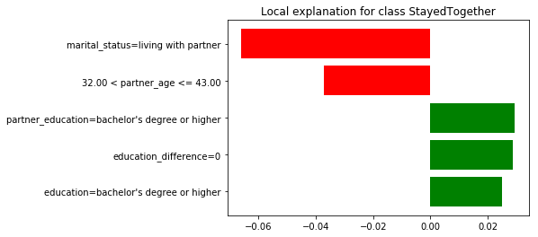]

P(together) ~ 0.79. Biggest negative is that couple lives together but isn't
married. Let's change that!

.footnote[From http://blog.fastforwardlabs.com/2017/09/01/LIME-for-couples.html]

---

# Relationship advice from a model?

.center.width-90[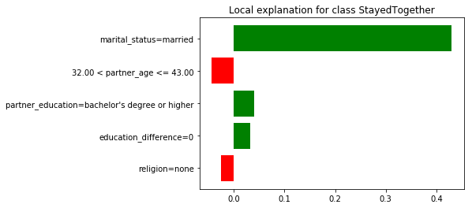]

P(together) ~ 0.91. Hurrah!

--

"Empirically observed covariation is a necessary but not sufficient condition for causality." - Tufte.

.footnote[From http://blog.fastforwardlabs.com/2017/09/01/LIME-for-couples.html]

---

# ANCHOR, improving on LIME

One definition of human interpretability is:

> Can I predict what the model will do?

LIME explains local feature importance. Unclear if these feature importances
apply to an unseen instance.

.center.width-80[]

---

# ANCHOR, improving on LIME

An anchor explanation is a rule that sufficiently "anchors" a prediction
locally - such that changes to the rest of the feature values of a sample
do not matter.

> for instances on which the anchor holds, the prediction is (almost) always the same.

--

Example anchor:

> Education = Bachelors AND Relationship = Husband AND Occupation = Sales

Promise is that >95% of samples that match the anchor are classified like the
example used to create the anchor.

Checkout https://homes.cs.washington.edu/~marcotcr/aaai18.pdf and https://github.com/marcotcr/anchor.

---

# So far all of these ideas are somewhat adhoc

---

# Paying for lunch

.width-90.center[]

---

# Dinner with math geeks

Three friends: *A*lice, *B*ob, and *C*harlie. They like to have long, chaotic
lunches together.

---

# Axioms to define what is a fair contribution

This is lunch with maths people, we need axioms.

1. Efficiency: sum of all contributions has to equal the total bill
1. Symmetry: if all lunch coalitions where we swap A for B cost the same, A and
 B should pay the same
1. Dummy: if adding you to the lunch coalition doesn't increase the price you
 shouldn't have to pay anything

---

# The Price of Lunch

*A*lice, *B*ob, and *C*harlie. We have a function $v(c)$ that tells us how big the bill is for each lunch
"coalition":

| Coalition | Price |
|-----------|-------|
|{$A$}   | 80 |
|{$B$}   | 56 |
|{$C$}   | 70 |
|{$A, B$}   | 80 |
|{$A, C$}   | 85 |
|{$B, C$}   | 72 |
|{$A, B, C$}   | 90 |

---

# Dinner with math geeks

*A*lice, *B*ob, and *C*harlie have lunch together, the bill is 90. Now we need
to work out how much each of them owes.


.left-column[
| Coalition | Price |
|-----------|-------|
|{$A$}   | 80 |
|{$B$}   | 56 |
|{$C$}   | 70 |
|{$A, B$}   | 80 |
|{$A, C$}   | 85 |
|{$B, C$}   | 72 |
|{$A, B, C$}   | 90 |
]

.right-column[
| Arrival order | Bar tab |
|-----------|-------|
| (A, B, C)  | (80, 0, 10) |
| (B, A, C)  | (24, 56, 10) |
| (A, C, B)  | (80, 5, 5) |
| (B, C, A)  | (18, 56, 16) |
| (C, A, B)  | (15, 5, 70) |
| (C, B, A)  | (18, 2, 70) |
]

---

# Dinner with math geeks

*A*lice, *B*ob, and *C*harlie have lunch together, the bill is 90. Now we need
to work out how much each of them owes.


.left-column[
| Coalition | Price |
|-----------|-------|
|{$A$}   | 80 |
|{$B$}   | 56 |
|{$C$}   | 70 |
|{$A, B$}   | 80 |
|{$A, C$}   | 85 |
|{$B, C$}   | 72 |
|{$A, B, C$}   | 90 |
]

.right-column[
| Arrival order | Bar tab |
|-----------|-------|
| (A, B, C)  | (80, 0, 10) |
| (B, A, C)  | (24, 56, 10) |
| (A, C, B)  | (80, 5, 5) |
| (B, C, A)  | (18, 56, 16) |
| (C, A, B)  | (15, 5, 70) |
| (C, B, A)  | (18, 2, 70) |
| Average:  | (39.2, 20.7, 30.2) |
]

---

# Shapely values

Named in honour of Lloyd Shapley, who introduced it in 1953. How to split the
winnings of a coalition of players in a cooperative game.

https://doi.org/10.1515%2F9781400881970-018 or Shapley, Lloyd S. (1953). "A Value for n-person Games". In Kuhn, H. W.; Tucker, A. W. Contributions to the Theory of Games. Annals of Mathematical Studies. 28. Princeton University Press. pp. 307–317.

--

## Application to machine-learning:

Our model predicts a house costs 24410, the average house in our dataset
costs 22340. We'd like to know why this house is more expensive.

---

# A coalition of features

Treat the group of feature values as a coalition. Together they achieve "winnings"
of $24410 - 22340 = 2070$ and we can attribute to each feature value a
part of these winnings.

We have six features describing our houses.

.width-100[]

---

# Shapley Values in ML

https://github.com/slundberg/shap

and their papers:
* http://papers.nips.cc/paper/7062-a-unified-approach-to-interpreting-model-predictions
* https://arxiv.org/abs/1802.03888

---

# Ask questions of your model

Most important tool: think like a scientist.

Generate a hypothesis that you can test, test it.

---

# Predicting how much someone will earn

Your task is to build a model that will predict if someone earns more or less
than $50000. Maybe we want to use this to determine if we should make a loan to
this person.

Data contains features like: age, years of education, type of education,
gender, race, how many hours they work, relationship status, etc

Fit a random forest classifier. Job done.

---

# Hypothesis: gender bias

Does our model give different responses when we change the gender?
How to check if our model is biased?

.center.width-60[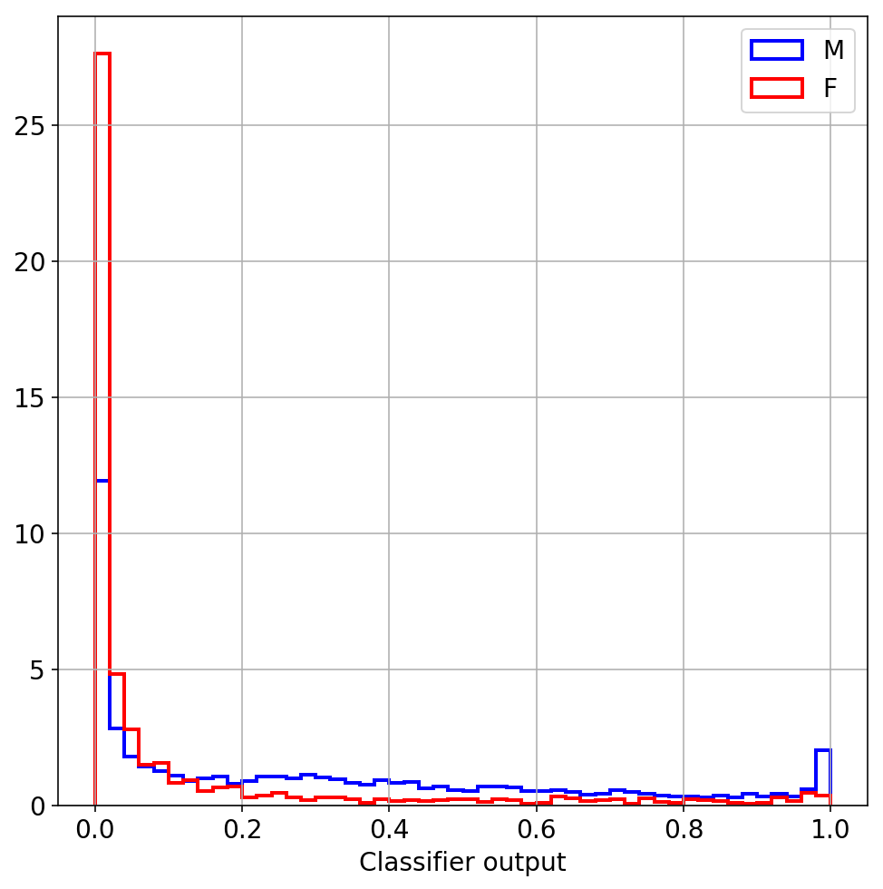]

---

# Hypothesis: gender bias

Let's remove gender from our input variables!

Does not make much difference.

.center.width-60[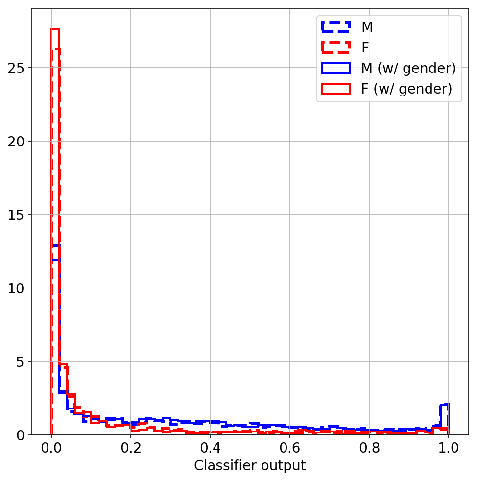]

---

# Make use of gradient boosting

Include a penalty term in the loss function that encourages "uniformity"
in a set of protected attributes.

.center.width-90[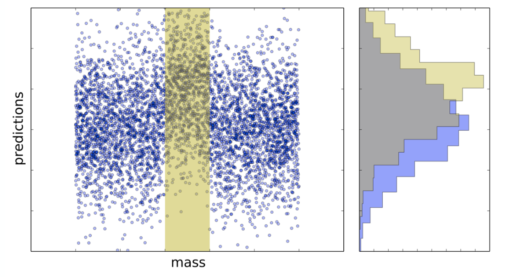]

.footnote[https://doi.org/10.1088/1748-0221/10/03/T03002]

---

# Make use of gradient boosting

.center.width-50[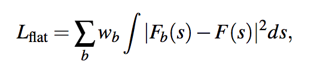]

$F_b$ is the cumulative distribution of the classifier output in region $b$,
$F$ is the cumulative distribution function of the classifier globally.

Intuition: if there is a difference between the two you have information about
which region you are in.

Based on the Cramér–von Mises criterion, a goodness of fit measure for cumulative
distribution functions.

.footnote[https://doi.org/10.1088/1748-0221/10/03/T03002]
---

# Invented for particle physics

.center.width-90[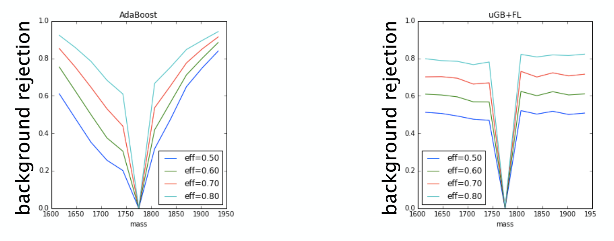]

---

# Generative Adversarial Networks

A game palyed between two neural networks:

1. tries to classify people as high or low income
1. tries to classify the gender of the subject based on the output of 1.

The objective is to make 1. as good as possible and 2. as close as possible to random
guessing.

Intuition: if the output of 1. contains information about the gender then 2.
should be able to do better than guessing.

.footnote[https://arxiv.org/abs/1611.01046]

---

# Learning to pivot

.center.width-90[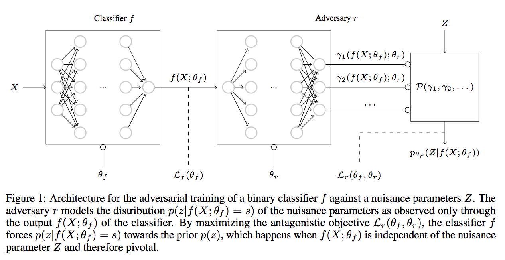]

.footnote[https://arxiv.org/abs/1611.01046]

---

# Learning to pivot

.center.width-90[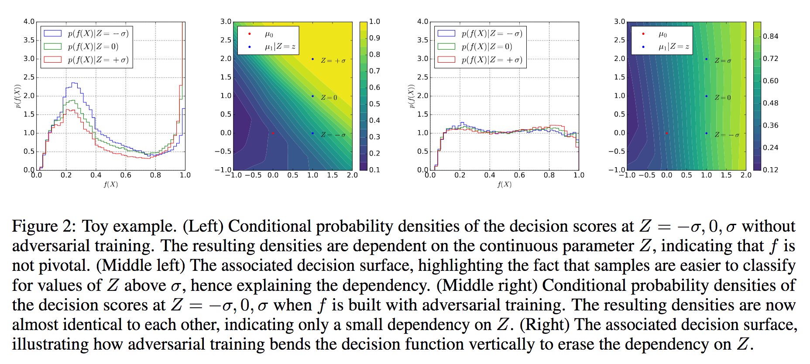]

Code and examples: https://github.com/glouppe/paper-learning-to-pivot

Application to the banking dataset: https://github.com/glouppe/notebooks/blob/master/Fair%20classifier%20with%20adversarial%20networks.ipynb

.footnote[https://arxiv.org/abs/1611.01046]

---

Treat your machine-learning model like a research problem. Generate hypotheses
that you can falsify and then check them.

---

class: middle, center

# The end.
